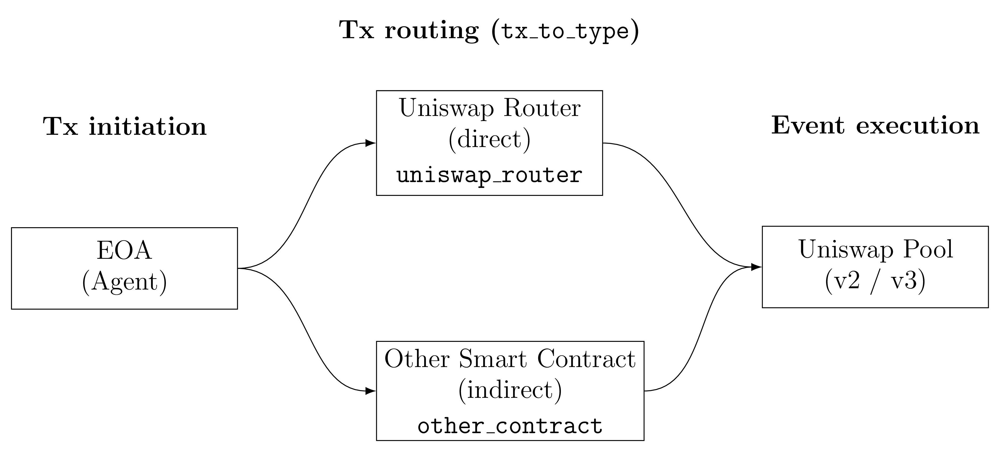
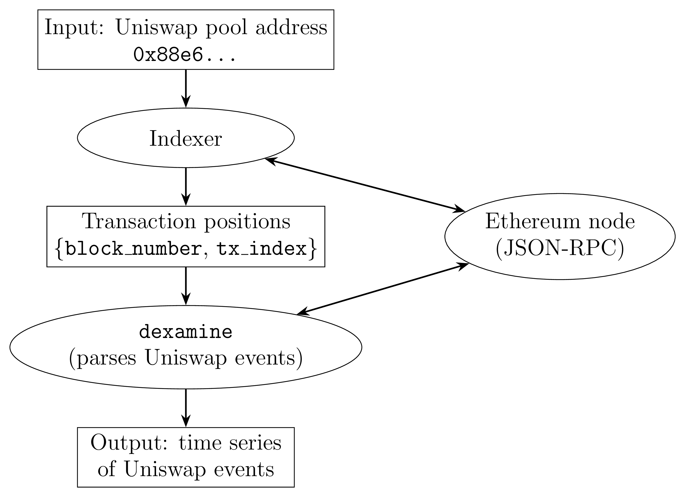

# Summary

`dexamine` is a Python package that turns raw Ethereum transaction data into structured,
analysis-ready records of decentralized exchange (DEX) activity. Given a transaction
position -- a block number and the index of a transaction within that block -- it
fetches the transaction, its receipt and its block from any Ethereum JSON-RPC endpoint,
decodes the Uniswap events emitted in the receipt logs, and returns normalized rows that
combine the economic content of each event with the execution metadata of the
transaction that produced it.

Version `1.0.0` supports Uniswap v2 [@adams2020] and Uniswap v3 [@adams2021] on Ethereum
mainnet, and parses the three events that define a constant-function market: `swap`,
`mint` and `burn`. Each parsed event carries the token symbols and decimals of the pool,
amounts converted to base units, and -- for swaps -- the resulting pool state (reserves,
mid price and invariant for v2; tick, `sqrtPriceX96`, price and virtual reserves for v3).
Alongside the event, `dexamine` reports the block timestamp, base fee, gas limit and gas
used, the transaction's position in its block, its gas price and EIP-1559 fee fields, the
gas actually consumed, and a routing classification of the transaction. The package
builds on the block, transaction and state-transition abstractions of Ethereum
[@buterin2013; @wood2014] and reads them through the standard JSON-RPC interface, so it
works against any compliant client, such as `Erigon` [@erigon].

# Statement of need

Empirical work on decentralized exchanges is transaction-level work. Questions about
price discovery, liquidity provision, execution quality and arbitrage cannot be answered
from trade prices and volumes alone: they require knowing when in a block a trade
executed, what it paid in gas, what path it took to the pool, and what the pool looked
like immediately afterwards [@lehar2025; @barbon2025]. Because Ethereum orders
transactions within blocks and prices execution through a fee market, that metadata *is*
the microstructure -- it is not incidental to the trade, it is what distinguishes one
trade from another at the same price [@daian2020].

That combination is exactly what is missing from the data most researchers actually use.
Hosted analytics platforms and community-maintained subgraphs return aggregated series
in which the link between an event and the transaction that produced it has already been
dropped, and they cannot be re-run offline or pinned to a version, which makes results
built on them hard to reproduce. General-purpose blockchain extraction tools go the other
way: they export blocks, transactions and raw logs faithfully but leave protocol
semantics to the user, so every project re-implements Uniswap log decoding, ERC-20
metadata resolution and fixed-point conversion, each time with its own quiet mistakes.

`dexamine` closes that gap for Uniswap. It is a small, installable library that a
researcher points at their own node, and it returns one row per DEX event with both the
protocol-level and the transaction-level fields already joined and converted. The output
is deterministic: the same input position against the same chain history always yields
the same row, so an analysis can be regenerated from the chain rather than from a
snapshot of somebody else's database. The package has been used to construct the datasets
in @hansson2024.

# State of the field

`web3.py` [@web3py] provides the Python bindings to an Ethereum node that `dexamine` also
uses internally, but it stops at generic contract and RPC access; it has no notion of a
Uniswap swap, of token decimals, or of a pool's post-trade state. `Ethereum ETL`
[@ethereumetl] and `cryo` [@cryo2023] extract blocks, transactions and logs at scale into
columnar files, and are excellent at that, but they deliberately remain
protocol-agnostic: log payloads arrive as undecoded hexadecimal. `Graph Node`
[@graphnode] and hosted query platforms do encode protocol semantics, but as a
server-side indexing service whose outputs depend on a deployed subgraph and a hosted
endpoint, which is a poor fit for archival reproducibility. `TrueBlocks` [@trueblocks]
solves a complementary problem -- it indexes which transactions touched a given address,
and its output is a natural input to `dexamine`, which then parses those transactions.

`dexamine` occupies the remaining position: a local, versioned, protocol-aware parser
that produces a joined event-and-metadata table for Uniswap, with no hosted dependency.

# Functionality

The public API is deliberately small. `parse_position` parses a single position;
`DexamineSession` amortizes ABI loading, pool and token metadata across many calls and
is the entry point for large workloads:

```python
from dexamine import DexamineSession

session = DexamineSession.from_node_url("http://localhost:8545")

for row in session.parse_positions(
    positions=[(12376729, 59), (12376729, 60)],
    protocol="uniswap_v3",
    exchange_pair_address=None,   # or a pool address to filter on
    batch_size=2000,
    output_format="flat",
):
    # row is one dict per parsed event, ready for csv.DictWriter
    ...
```

Parsing proceeds in four steps. The receipt logs are scanned for the Uniswap event
signatures; each matching log's payload is decoded from its 32-byte words, with signed
quantities such as v3 amounts and ticks read as two's complement; token symbols and
decimals, and the pool's token pair, are resolved from the chain and cached per session;
and the decoded values are converted to base units and assembled into a record. Uniswap
v2 additionally requires the `Sync` event that precedes each `swap`, `mint` or `burn`
from the same pool, since that is where post-event reserves are published; `dexamine`
verifies this ordering and skips events for which it does not hold rather than reporting
an unverified state.

Two output formats are offered. `raw` returns the node payloads together with the parsed
events, for users who want everything. `flat` returns one row per event with a fixed
column order, missing numeric values represented as `None` rather than zero, and every
row carrying its block number, transaction index and log index, so rows remain uniquely
addressable after being written to CSV and re-sorted. Requests are batched over JSON-RPC
and results are yielded as a generator, so millions of positions can be streamed through a
process without accumulating in memory; sharding positions across worker processes, one
session each, is the documented path to scale.

## Transaction routing

`dexamine` also records how each transaction reached the pool, as the `tx_to_type` field.
The classification uses one input: the transaction's `to` address, matched against the
canonical Uniswap router and periphery deployments that ship with the package. This
yields the two routed cases of \autoref{fig:route} -- `uniswap_router` for a transaction
sent directly to Uniswap, `other_contract` for one routed through any other contract,
such as an aggregator, an arbitrage bot or another DeFi protocol -- plus
`contract_creation` when there is no `to` address.

{ width=100% }

This is a deliberately coarse and deliberately stable classification. A finer
attribution, in particular labelling maximal-extractable-value activity, would require a
curated list of bot addresses, and such lists both decay and disagree with one another.
Software that embedded one would silently change its output as the list aged, and results
published with one version could not be reproduced with another. `dexamine` therefore
derives routing only from protocol constants, and leaves finer attribution -- for which
`other_contract` is the natural starting point -- to the user, who can then state and
version the labelling their analysis depends on.

# Quality control

The package is type-annotated and checked with `mypy` in strict mode, formatted with
`black` and linted with `pylint`. The test suite runs offline: it replays recorded
JSON-RPC responses and pre-populates the metadata cache, so the log-decoding paths --
word-level decoding, two's-complement handling, the v2 `Sync` ordering rule, mint and
burn sign conventions, pool filtering, and the v3 zero-liquidity boundary case -- are
exercised without network access and without a node. A separate, opt-in integration suite
runs the same code against a live endpoint when one is supplied. Continuous integration
runs formatting, linting, type checking and the offline tests on every supported Python
version.

# Workflow and data requirements

\autoref{fig:workflow} shows how `dexamine` sits in a research pipeline. `dexamine`
parses positions; it does not discover them. Finding every transaction that touched a
given pool is an indexing problem, solved well by existing tools such as `TrueBlocks`
[@trueblocks], and `dexamine` is agnostic to which indexer and which client are used, so
long as it receives `(block_number, tx_index)` pairs and a JSON-RPC endpoint.

{ width=72% }

Pool and token metadata are read at the latest block, so an archive node, which retains
historical state, is not required. What is required is an endpoint that still serves the
blocks and receipts being parsed: a full node with complete history, or a provider that
has not pruned it. Recent blocks are available from ordinary public endpoints, which
makes the package usable without operating any infrastructure.

# Acknowledgements

I thank the teams at `TrueBlocks` [@trueblocks] and `Erigon` [@erigon] for their support
on node operation and indexing, and community members of Flashbots and Uniswap for their
help in understanding the protocols.

# References
